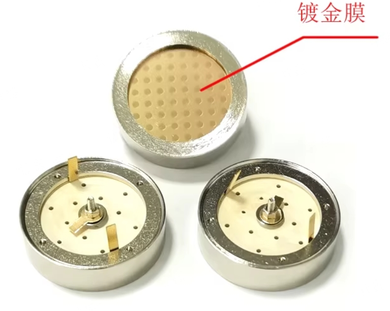
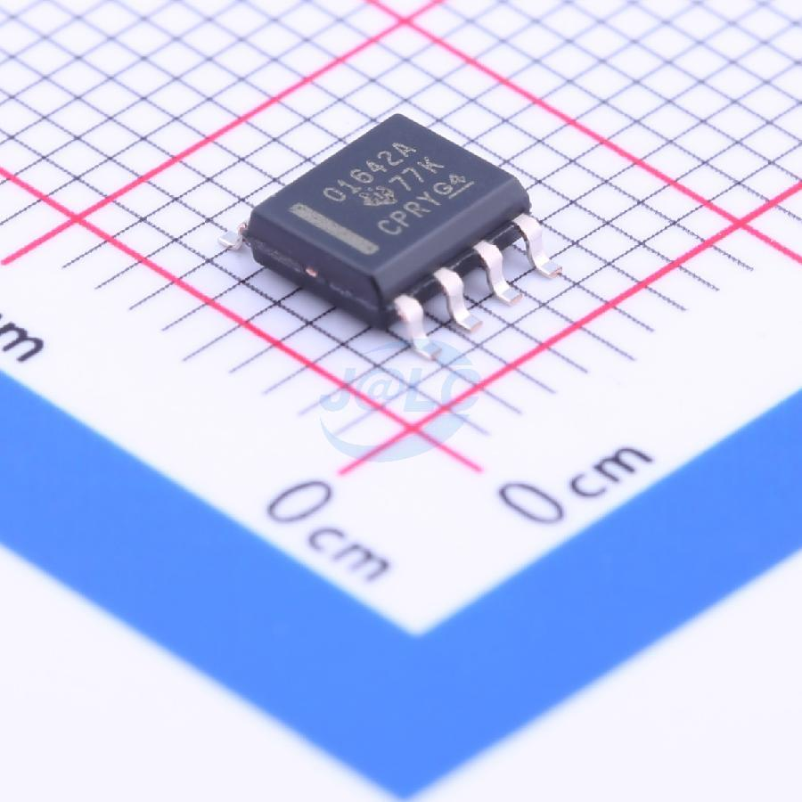
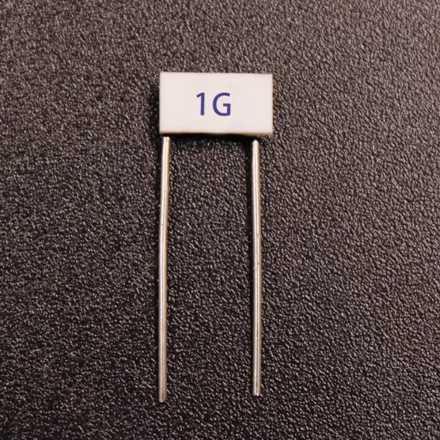
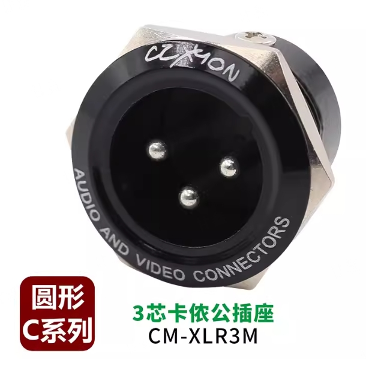

# Alice OPA ECM 麦克风

**简介：**使用下水道过滤网设计的DIY全屏蔽麦克风，优点是壳体便宜，益于购买，DIY乐趣颇多，缺点是屏蔽性可能存在不足，3D打印的部分零件需要增加铝膜屏蔽层，略显复杂。电路部分基于Alice OPA 驻极体麦克风电路设计，具有极低的底噪及失真率。  

**版权说明：**本项目允许用户查看、使用、修改源代码。禁止将项目或其衍生作品用于商业目的（例如：销售、作为商业服务的一部分盈利）。用户在使用或分发（包括修改版）时，必须保留原始版权和许可声明（注明出处）

<!-- PROJECT SHIELDS -->

[![Contributors][contributors-shield]][contributors-url]
[![Forks][forks-shield]][forks-url]
[![Stargazers][stars-shield]][stars-url]
[![Issues][issues-shield]][issues-url]
[![MIT License][license-shield]][license-url]
[![BiliBili][Bilibili-shield]][Bilibili-url]

<!-- PROJECT LOGO -->
<br />

<p align="center">
  <a href="https://github.com/grant-Gan/desktop_smart_lamp/">
    
  </a>
  <h3 align="center">AXin实验室</h3>
  <p align="center">
    生命不息，折腾不止，Axin致力于DIY想要又买不起的产品~
    <br />
    <a href="https://github.com/grant-Gan/desktop_smart_lamp"><strong>探索本项目的文档 »</strong></a>
    <br />
    <br />
    <a href="https://github.com/grant-Gan/desktop_smart_lamp">查看Demo</a>
    ·
    <a href="https://github.com/grant-Gan/desktop_smart_lamp/issues">报告Bug</a>
    ·
    <a href="https://github.com/grant-Gan/desktop_smart_lamp/issues">提出新特性</a>
  </p>

</p>

 
## 目录

- [Roadmap](#Roadmap)
- [下载步骤](#下载步骤)
- [文件目录说明](#文件目录说明)
- [使用的框架](#使用的框架)
- [依赖库](#依赖库)
- [版本控制](#版本控制)
- [零件选型](#零件选型)
    1. [电源适配器](#电源适配器)
    2. [数据线](#数据线)
    3. [灯管](#灯管)
    4. [角码](#角码)
    5. [悬臂支架](#悬臂支架)
    6. [其它](#其它)
- [PCB焊接](#PCB焊接)
    1. [无线控制版本](#无线控制版本)
    2. [滑动控制版本](#滑动控制版本)
- [作者](#作者)
- [版权说明](#版权说明)

# Roadmap

待增加功能：
1. 增加75Hz低切开关
2. 增加-10dB衰减开关，提升麦克风可录制的最大升压
3. 增加7kHz以后3dB shelf调音电路


### 文件目录说明

```
ECM_XLR_Microphone
├── .gitignore
├── LICENSE
├── README.md
├── /3D_Models
│   ├── Full_Models_3D_Printer.stl
│   ├── 上盖.stl
│   ├── 下盖.stl
│   ├── 咪头外壳.stl
│   └── 咪头支架_30mm.stl
├── /Images
│   └── Logo.png
├── /PCB
│   ├── /Gerber
│   │   └── Alice_OPA_Gerber.zip
│   ├── /Kicad_project
│   │   ├── Alice_OPA_ECM_Microphone.kicad_pcb
│   │   ├── Alice_OPA_ECM_Microphone.kicad_pro
│   │   ├── Alice_OPA_ECM_Microphone.kicad_sch
│   │   └── Alice_OPA_ECM_Microphone.round-tracks-config
│   ├── /PCB
│   │   └── OPA_Alice_ECM_Microphone_PCB.pdf
│   └── /Schematics
│       └── OPA_Alice_ECM_Microphone.pdf
└── /Reference Document
    ├── /Apmlifier
    │   └── TI-反向放大器电路.pdf
    └── /Supply_Design
        ├── CD4584.pdf
        ├── Phantom Power with Operational Amplifiers.pdf
        └── Voltage_multipliers_with_CMOS_gates.pdf
```

### 零件选型
#### 音头
理论上，不带JFET的驻极体音头都可以使用，大家可以自由选择，如视频中所说，C端消费者可以买到的比较靠谱的应该就是得胜捷韵那家的驻极体音头，大家不想折腾的话可以跟我选同款就好。灵敏度建议标准的-34dB
<p align="center">
    
  <p align="center">得胜JY-H25-20</p>
</p>

#### 屏蔽网
理论上，不带JFET的驻极体音头都可以使用，大家可以自由选择，如视频中所说，C端消费者可以买到的比较靠谱的应该就是得胜捷韵那家的驻极体音头，大家不想折腾的话可以跟我选同款就好。灵敏度建议标准的-34dB
<p align="center">
    
  <p align="center">得胜JY-H25-20</p>
</p>


#### 运算放大器
建议使用TI的OPA1642运放，这颗运放输入级为JFET，低噪声高阻抗，并且功耗比较低，声卡幻象电源可以推得动。
<p align="center">
    
  <p align="center">OPA1642</p>
</p>

#### 1G电阻
1G电阻我是在淘宝上买的玻璃釉高压电阻，注意阻值一定要选择1G以上的，小于这个值会导致声音没有低频。
<p align="center">
    
  <p align="center">1G 玻璃釉电阻</p>
</p>

#### 卡侬接头
使用的是科诺恩的三芯卡侬公插座，质量挺不错的，推荐大家使用
<p align="center">
    
  <p align="center">CM-XLR3M</p>
</p>

#### 螺丝螺母 

| 位置      | 型号      | 类型   | 螺丝头类型 | 数量 |
|---------|---------|------|-------|----|
| 上下壳固定 | M2.5*14 | 普通螺丝 | 内六角   | 8  |
| 中空螺柱  | M6*40外径10   | 螺柱 | 内六角   | 1  |
| 中空螺丝  | M6*20孔3.2      | 中空螺丝   | 六角    | 2  |
| 屏蔽网固定| M3*18   | 铆接螺丝 | 十字   | 3(套)  |

#### 其它
其它零件暂时没有需要重点注意的，想起来或者等到后续问的朋友比较多再行补充~

### PCB焊接

#### 无线控制版本
- 驱动板  
无线控制驱动板使用ESP32-C2模组，使用PWM调光，驱动芯片为LGS63042EP,中间部分仅需要焊接R9、R18两个下拉电阻及D5、D6两个稳压二极管，其中稳压二极管用于保护驱动芯片EN引脚，可选。  
**注意事项：驱动端输出电压较高，需使用50V以上电容。**
<p align="center">
    
无线控制版驱动板焊接参考 
</p>
  
- 控制板   
**注意事项：控制器焊接需要留意编码器的选型，本项目采用的编码器型号为EC11、手柄长度12mm、梅花柄、正码（顺时针）、旋转一圈脉冲20位**

<p align="center">
  
  <p align="center">控制器焊接参考</p>
</p>

<p align="center">
  
  <p align="center">控制器焊接参考</p>
</p>


### 作者

AXin实验室

Bilibili:@AXin实验室 小红书:@AXin实验室  闲鱼：@AXin实验室


### 版权说明
本项目采用 **Creative Commons Attribution-NonCommercial-ShareAlike 4.0 International License** 授权。
您可自由地：
*   **共享** — 在任何媒介以任何形式复制、发行本作品
*   **演绎** — 修改、转换或以本作品为基础进行创作

惟须遵守以下条件：
*   **署名** — 您必须给出[适当的署名](https://creativecommons.org/licenses/by-nc-sa/4.0/deed.zh)，提供指向本许可协议的链接，同时标明是否（对原始作品）作了修改。您可以用任何合理的方式来署名，但不得以任何方式暗示许可人为您或您的使用背书。
*   **非商业性使用** — 您不得将本作品用于商业目的。
*   **相同方式共享** — 如果您再混合、转换或者基于本作品进行创作，您必须基于[与原先许可协议相同的许可协议](https://creativecommons.org/licenses/by-nc-sa/4.0/deed.zh) 分发您贡献的作品。

完整的许可条款请见：[LICENSE](LICENSE) 文件。

该项目签署了MIT 授权许可，详情请参阅 [LICENSE.txt](https://github.com/grant-Gan/desktop_smart_lamp/LICENSE.txt)


<!-- links -->
[your-project-path]:grant-Gan/desktop_smart_lamp
[contributors-shield]: https://img.shields.io/github/contributors/grant-Gan/desktop_smart_lamp.svg?style=flat-square
[contributors-url]: https://github.com/grant-Gan/desktop_smart_lamp/graphs/contributors
[forks-shield]: https://img.shields.io/github/forks/grant-Gan/desktop_smart_lamp.svg?style=flat-square
[forks-url]: https://github.com/grant-Gan/desktop_smart_lamp/network/members
[stars-shield]: https://img.shields.io/github/stars/grant-Gan/desktop_smart_lamp.svg?style=flat-square
[stars-url]: https://github.com/grant-Gan/desktop_smart_lamp/stargazers
[issues-shield]: https://img.shields.io/github/issues/grant-Gan/desktop_smart_lamp.svg?style=flat-square
[issues-url]: https://img.shields.io/github/issues/grant-Gan/desktop_smart_lamp.svg
[license-shield]: https://img.shields.io/github/license/grant-Gan/desktop_smart_lamp.svg?style=flat-square
[license-url]: https://github.com/grant-Gan/desktop_smart_lamp/blob/master/LICENSE.txt
[Bilibili-shield]: https://img.shields.io/badge/bilibili-00A1D6?logo=bilibili&logoColor=white
[Bilibili-url]: https://www.bilibili.com/video/BV1rygnzuE4w


